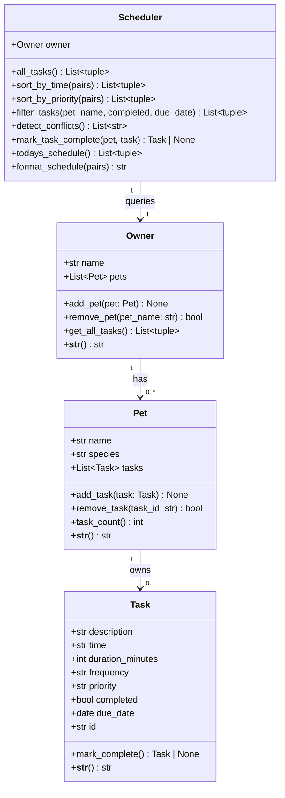

# PawPal+ — Final UML Diagram

## Relationship notes

- `Owner` **has** zero or more `Pet` objects (composition — pets belong to one owner).
- `Pet` **owns** zero or more `Task` objects (composition — tasks are attached to a pet).
- `Scheduler` **queries** the `Owner` to retrieve all `(Pet, Task)` pairs without storing them — it is stateless beyond holding a reference to the owner.
- `mark_complete()` on a `Task` returns a *new* `Task` instance for recurring tasks (daily/weekly), ensuring the original is immutably closed and the follow-up is a first-class object.
